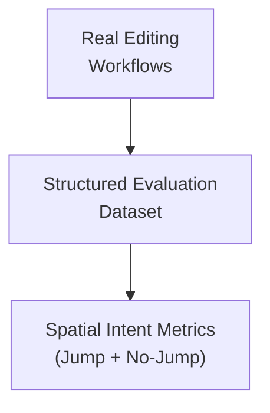

# Long Distance Next Edit Suggestions: How We Extended NES Across Your Entire File

February 18, 2026 by [TODO](https://github.com/TODO)

## From nearby edits to anywhere in the file

Last February, we released [next edit suggestions (NES)](/docs/copilot/ai-powered-suggestions.md#next-edit-suggestions) in GitHub Copilot. NES extends ghost text by not just inserting code at your cursor, but suggesting edits nearby, anticipating what you'd change next and surfacing it inline.

**Ghost Text**

**NES**

On the GitHub Copilot team, we use the features we build every day. That tight feedback loop is how we spotted the next opportunity: NES worked well within a small window around your cursor, but real editing workflows often don't stay in one place. You rename a function, then scroll down to update every call site. You change a parameter type, then search through the file for every spot that depends on it. The next edit you need is often several screens away.

What if NES could follow that train of thought?

That's the problem we set out to solve with long-distance next edit suggestions. This post tells the story of how we built it: the modeling challenges, the UX decisions, and an unexpected lesson about teaching a model *restraint*.

## Going long-distance

We set out to extend NES-style edits to arbitrary locations throughout a file. Instead of suggesting edits only near your cursor, the goal was to anticipate where your next meaningful change might occur, even several screens away.

This quickly became a modeling problem: how do you predict developer intent across space? In many workflows, such as renaming symbols, updating related logic, or modifying function signatures, the next edit is not adjacent to the current one. At the same time, jumping unnecessarily can break flow. The system must learn not only where to move, but also when not to move.

Rather than modifying the existing edit-generation model, we took a modular approach. We trained a separate model whose sole responsibility is to predict promising edit locations. The original NES model continues to generate the edit itself once a location is selected.

This separation allows each model to specialize. One learns spatial intent, and the other produces high-quality edits within a local window. It also enables independent iteration on location prediction without disrupting ongoing improvements to the core NES edit model.

In order to train a location model, we needed a way to evaluate whether it was actually working.

## Measuring success via an evaluation framework

To ensure the model improved real-world editing behavior, we designed a structured three-step evaluation process:

1. Identify common multi-edit workflows
2. Construct representative cursor-jump examples
3. Measure both jump and no-jump accuracy

The overall evaluation framework is summarized below:

First, we analyzed how developers chain together edits in practice rather than treating edits as isolated events. We observed several common workflows, including:

- Renaming variables, functions, or classes
- Modifying function signatures
- Updating related documentation

These patterns share a key property: edits occur in multiple, non-adjacent locations within a file.

Second, based on these workflows, we built an evaluation dataset that captures the signals required for location prediction. Each example includes the ground-truth next line to jump to, recent edit history, and cursor context.

Finally, we explicitly measured both jump and no-jump behavior. While many examples required predicting a new location, a meaningful subset required staying on the current line. This distinction is critical; a model that jumps too often can be as disruptive as one that misses important transitions.

By grounding evaluation in realistic multi-edit workflows and separating jump from no-jump cases, we ensured that offline metrics reflected actual editing behavior rather than artificial scenarios.

## Building the training dataset

With evaluation in place, we turned to training data. While the evaluation dataset was small enough to construct by hand, training required data at a much larger scale. To start out, we used same the data from our special data curation effort detailed in [our other post on training NES](https://github.blog/ai-and-ml/github-copilot/evolving-github-copilots-next-edit-suggestions-through-custom-model-training/). This dataset contains trajectories of how a developer moves and makes edits through a file.

By replaying these trajectories, we can transform every cursor movement into a training sample. After applying some filters, such as ensuring the jump location appeared in the prompt, we constructed our training dataset.

## Training with supervised finetuning

To train the location model, we used Supervised Finetuning (SFT) with targeted hyperparameter search. Our strongest results came from a structured grid search centered around the hyperparameters of the existing NES model. By constraining the search space to values already known to perform well in a related setting, we were able to efficiently explore combinations and identify a high-performing configuration.

Before settling on this approach, we also experimented with Bayesian Optimization, a technique designed to optimize expensive black-box functions. In our case, each evaluation required training a model from scratch, making experimentation computationally costly. While theoretically appealing, this approach did not yield improvements over the more focused grid search.

Ultimately, the structured grid search produced our best-performing supervised model and provided a stable foundation for subsequent iterations.

Extending the range of NES fundamentally changed what the system could do. But unlocking that capability required careful UX design to ensure suggestions feel discoverable, unobtrusive, and trustworthy. A better model alone is not enough if you never notice or trust the suggestions it produces. That meant the next challenge was designing for the user's experience.

## Designing UX for distant edits

Extending NES requires continuously balancing three competing concerns:

* Keeping suggestions small
* Making them easy to read
* Minimizing how much of your code is obscured

This balance becomes especially important when suggestions affect parts of the file that are not currently visible on your screen.

Next edit suggestions generally appear close to the cursor and within your immediate view, making them naturally discoverable while you were already focused on that section of code. With long-distance NES, however, the most relevant next edit may be several screens away. This introduces a new challenge: the system must surface spatially distant edits without disrupting flow or eroding trust.

In practice, this is not just a discoverability problem but a trust-calibration problem. When a model proposes moving your cursor elsewhere, you need to quickly assess whether that jump is relevant and worth your attention. The UI must communicate enough context to evaluate the suggestion without demanding a full context switch.

To address this, we optimized for minimal disruption and rapid assessment. Rather than rendering large diffs inline or forcing attention shifts, we designed a compact widget that appears near your cursor and prefers empty space when available. The widget adapts to the surrounding editor layout, shrinking or expanding to fit naturally into whitespace such as at the end of a line or between blocks of code.

Because the full edit may be far away and potentially large, the widget does not attempt to render the entire suggestion. Instead, it provides a lightweight preview, an excerpt from one of the affected lines, rendered with diff-style highlighting. This gives you just enough context to judge relevance and decide whether to act.

If the preview looks useful, you can explicitly choose to jump to the suggested location and review or apply the full edit there. If not, you can continue editing uninterrupted.

## Internal testing and a key realization: Restraint

We always dogfood and iterate internally before shipping new capabilities. Long-distance NES was no exception.

During internal testing, one insight quickly became clear: predicting when _not_ to jump is just as important as predicting where to jump. In fact, it is often harder.

While many of the model’s jump predictions were directionally correct, it was too eager to move the cursor. Even reasonable suggestions can become distracting if they appear too frequently. In a system that proactively proposes spatial changes, overconfidence is costly.

When we analyzed evaluation metrics more closely, we found the root cause. Our dataset contained far fewer “no jump” examples than jump examples. In other words, the model had learned to predict movement more confidently than restraint.

To address this, we reintroduced and expanded samples where the correct action was to remain on the current line. These included cases such as partially typed identifiers, where jumping elsewhere would not make sense. After rebalancing the dataset and retraining, both jump and no-jump accuracy improved significantly.

More importantly, the qualitative feedback from dogfooding shifted. Suggestions felt more intentional and less intrusive, reinforcing that restraint is a first-class requirement in spatial prediction.

## Online A/B testing

Before shipping long-distance NES, we needed to validate at scale. We ran online A/B testing, comparing long-distance NES against standard NES. Our primary goal was to measure impact on real editing behavior: does this actually help you write and update code more efficiently?

The initial results were positive. With long-distance edits enabled, we observed a 23% increase in code written via NES, along with improvements across several other engagement and acceptance metrics.

At the same time, the experiment surfaced an important tradeoff. While expanded capabilities increased productivity, far-away suggestions were rejected more often than standard NES. Some of this was expected, given a new interaction pattern and broader edit scope. However, it also signaled an opportunity to improve how confidently and selectively suggestions were presented.

Rather than treating this purely as a modeling issue or purely as a UX issue, we viewed it as a systems problem. Improving long-distance NES required tightening the model's jump predictions while also ensuring the interface made it easy to assess and accept relevant suggestions.

## Reinforcement Learning: Learning when not to jump

One of the most important lessons from early testing was this: predicting *where* to jump is only half the problem. The harder problem is knowing *when not to jump at all.*

While the supervised model performed well offline, the internal testing and online A/B experiments revealed that it was still too eager to move the cursor. Even when individual predictions were reasonable, suggesting a jump at the wrong moment could interrupt flow and erode trust. Precision alone was not enough. The model needed restraint.

To address this, we introduced a reinforcement learning stage using Reinforcement Learning with Verified Rewards (RLVR). Instead of relying solely on supervised labels, we added a grading signal based on how closely the model’s predicted jump location matched the eventual cursor movement. Predictions that aligned closely with actual editing behavior were rewarded more strongly, while unnecessary or poorly timed jumps were penalized.

This allowed the model to directly optimize for spatial intent under real editing conditions, without requiring new manual annotations or UX instrumentation.

The result was a better balance between initiative and restraint. The updated model improved offline metrics and translated those gains into online performance, increasing code written via NES while reducing rejection rates. With those signals in place, we began shipping the improved version the following month.

## What's next?

Looking ahead, we plan to extend this work by incorporating cross-file long distance suggestions, enabling the model to reason beyond the current file. We also aim to explore a unified model that jointly predicts both the location of the next edit and the edit itself, allowing for tighter coupling between cursor movement and code generation and potentially improving overall suggestion relevance and user experience.

## Try It Out

Long-distance next edit suggestions are available now in [VS Code](https://code.visualstudio.com/) for users with a [GitHub Copilot](https://github.com/features/copilot) subscription. Give it a try the next time you're doing refactoring work—renaming variables, updating function signatures, or making changes that ripple through your file. We'd love to hear your feedback!

Happy coding! 💙

---

#### Acknowledgements

First, a big shoutout to our developer community for continuing to give us feedback and push us to deliver the best possible experiences with VS Code and GitHub Copilot. Moreover, a huge thanks to the researchers, engineers, product managers, designers across GitHub and Microsoft who curated the training data, built the training pipeline, evaluation suites, client and serving stack – and to the VS Code and GitHub Copilot product and engineering teams for smooth model releases.
